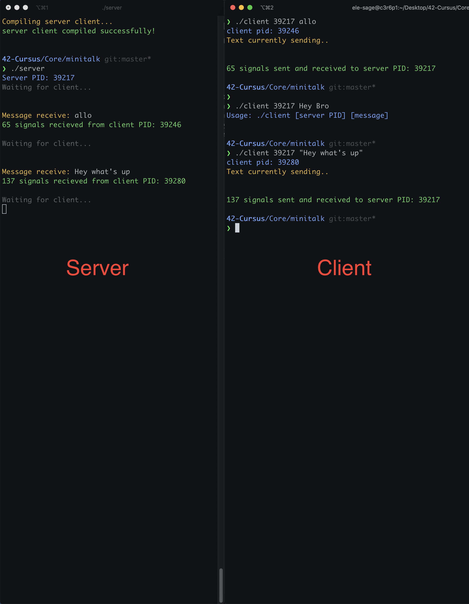

# minitalk

This project is about creating a client and a server that can communicate using UNIX signals. The client sends a string to the server, and the server displays the string once it has received it.

## Usage

```shell
make
./server
./client <server_pid> <message>
```

## Demo
